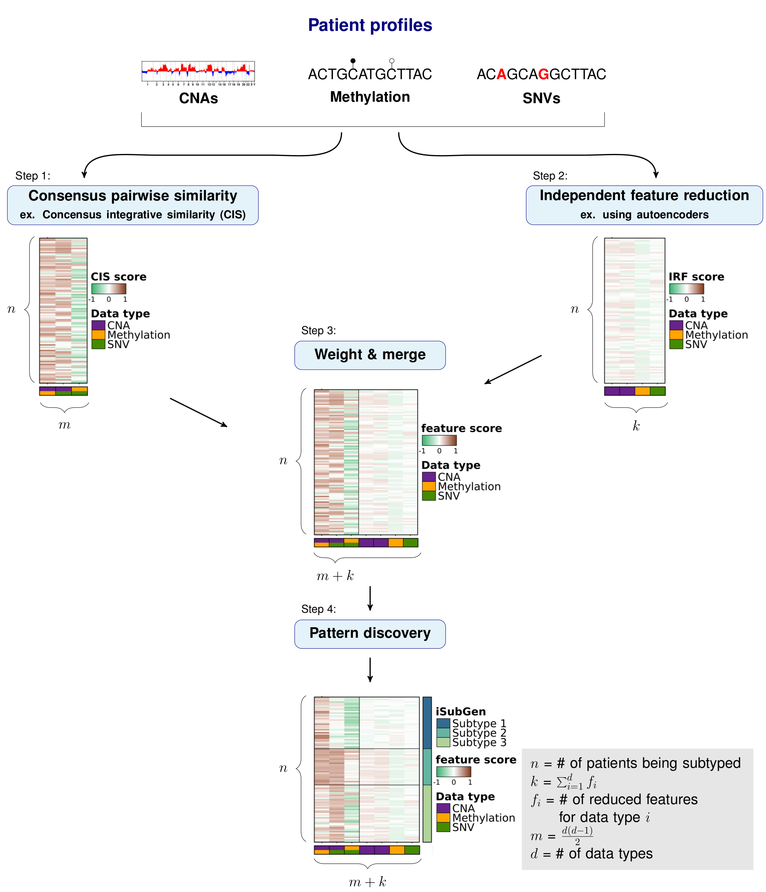

# iSubGen R package

- [iSubGen](#pipeline-name)
  - [Overview](#overview)
  - [Independent feature reduction](#independent-feature-reduction)
  - [Pairwise similarity matrix](#pairwise-similarity-matrix)
  - [Combine features and create integrative subtypes](#combine-features-and-create-integrative-subtypes)
  - [Glossary/Acronyms](#glossary/acronyms)

## Overview

The purpose of integrative subtype generation (iSubGen) is to provide a framework for subtype discovery
based on the relationships between molecular aberration profiles such as mRNA, single nucleotide variants (SNV), copy number alterations (CNA), _etc._
without filtering to known genes or relationships.
iSubGen performs pattern discovery on a combination of two types of integrative features.
First, we use a collection of reduced features to allow emphasis of obvious patterns in the individual data types.
The reduced features could be a small number of compressed features from autoencoders or the top principle components or even a handful of selected important characteristics of the profiles.
The second type of integrative feature is pairwise comparison of the data types.
This will allow patient classification based on whether the same relationships are observed in the different data types.



### Applying iSubGen to an example

We will demonstrate how to use iSubGen with a small example dataset.
This example has CNA profiles, methylation profiles and coding SNV data for 30 patients.
The CNA data is gene based with -1 for a deletion, 0 for neutral and 1 for a gain.
The methylation data is probe based and is continuous values between -1 and 1.
The coding SNV data is gene based with 0 if there is no SNV in the gene and 1 if there is 1 or more SNV(s) in the gene.

### Load and format data

The first step is to load the data. Here the genomic features are rows and patients are columns.

```{r load-data}
# Load the library and the data included with the package
library(iSubGen);
molecular.data <- list();
for(i in c('cna','methy','snv')) {
  molecular.data[[i]] <- load.molecular.aberration.data(
    system.file('exdata',paste0(i,'_profiles.txt'), package='iSubGen'),
    patients = c(paste0('EP00',1:9), paste0('EP0',10:30))
    );
}

# Check what the data looks like
str(molecular.data);
molecular.data$methy[1:5,1:5];
molecular.data$snv[1:5,1:5];
```


## Independent feature reduction

### Autoencoders

To be able to emphasize the main patterns in the individual aberration profiles,
we compressed the full sets of features to a smaller set that capture the overarching patterns of each data type.
These features are called independent reduced features (IRFs).
In this case, we use autoencoders to reduce the features to a handful of compressed features representing the main patterns of each data type.

An autoencoder is a neural net which is trained the output to the input it was given generally for the purpose of feature reduction.
The number of nodes will decrease in the first layers to "encode" the data
and then the number of nodes will increase in the following layers to "decode" the data.
In this way, if we take the values from the smallest number of nodes at the interface of the encoding and decoding layers,
all the data of the input features should be represented in a smaller number of features.
A benefit of using autoencoders for compressing features is that autoencoders can capture non-linear relationships.


### Create independent reduced features (IRFs)

We create autoencoders individually for each data type.
The create.autoencoder function is a wrapper function to create an autoencoder using the [keras](https://cran.r-project.org/package=keras) package.
Here we create two compressed features for the CNA feature set and one compressed feature for each of the SNV and methylation feature sets.

```{r ae-matrix}
# Create a list to store the autoencoders
autoencoders <- list();

# Create and train an autoencoder using CNA data
autoencoders[['cna']] <- create.autoencoder(
  data.type = 'cna',
  data.matrix = molecular.data$cna,
  encoder.layers.node.nums = c(20,2)
  )$autoencoder;
# take a look at the layers/number of nodes in the autoencoder
str(autoencoders$cna);

# Create and train an autoencoder using methylation data
autoencoders[['methy']] <- create.autoencoder(
  data.type = 'methy',
  data.matrix = molecular.data$methy,
  encoder.layers.node.nums = c(15,1)
  )$autoencoder;
# take a look at the layers/number of nodes in the autoencoder
str(autoencoders$methy);

# Create and train an autoencoder using coding SNV data
autoencoders[['snv']] <- create.autoencoder(
  data.type = 'snv',
  data.matrix = molecular.data$snv,
  encoder.layers.node.nums = c(15,1)
  )$autoencoder;

# Get the independent reduced features from the autoencoders
irf.matrix <- create.autoencoder.irf.matrix(
  data.types = names(molecular.data),
  data.matrices = molecular.data,
  autoencoders = autoencoders
  );

# Check what the data looks like
str(irf.matrix);
```

## Pairwise similarity matrix

In this example, we describe using correlations to compare the distances between patient profiles, but any similarity measure could be substituted.

### Similarity matrix

Importantly, iSubGen assesses variation between data types by evaluating consensus integrative similarity (CIS).
The similarity matrix is created by first creating the distance matrix for each data type.
This is the standard first step for clustering based on a single data type.
However, instead of clustering each distance matrix, the distances from a single patient to the other patients is correlated between data types.
This provides an assessment of how similar the relationships between patients are in the different data types
and might elucidate whether there are different biological regulation subgroups of the cancers.


### Create a correlation matrix

```{r correlation-matrix}
# Calculate a similarity matrix using correlations
similarity.matrix <- calculate.integrative.similarity.matrix(
  data.types = names(molecular.data),
  data.matrices = molecular.data,
  dist.metrics = list(
    cna = 'euclidean',
    snv = 'euclidean',
    methy = 'euclidean'
    )
  );

# Check what the data looks like
str(similarity.matrix);
```

### Consensus integrative similarity (CIS) matrix

Either a integrative similarity matrix or a CIS matrix can be identically used to create subtypes.
A CIS matrix simply includes resampling of the samples while creating the correlation matrix.

```{r consensus-correlation-matrix}
# Calculate the CIS matrix
cis.matrix <- calculate.cis.matrix(
  data.types = names(molecular.data),
  data.matrices = molecular.data,
  dist.metrics = list(
    cna = 'euclidean',
    snv = 'euclidean',
    methy = 'euclidean'
    )
  );

# Check what the data looks like
str(cis.matrix);
```

## Combine features and create integrative subtypes

### Combine integrative features

Depending on where you want the emphasis for your subtype discovery, features may need to be reweighted when combined into one matrix.
There may also need to be rescaling performed if the feature reduction and pairwise similarity return features which are not in similar spaces.
Here we use tanh on our activation function for the autoencoders so that our independent reduced features are in -1 to 1 range.
Similarly, we use Spearman's correlation and correlations return values in the -1 to 1 range.

```{r integrative-matrix}
# Combine IRFs and CISs into one matrix
integrative.features.matrix <- combine.integrative.features(
  irf.matrix,
  cis.matrix
 )$integrative.feature.matrix;

# Check what the data looks like
str(integrative.features.matrix);
head(integrative.features.matrix);
```

### Find patterns in integrative features

Finally, pattern discovery must be performed on the integrative feature matrix to determine cancer subtypes.
In this example, we use [consensus clustering](https://bioconductor.org/packages/release/bioc/html/ConsensusClusterPlus.html) to iteratively run hierarchical clustering.

```{r cluster}
# Perform consensus clustering to get integrative subtypes
subtyping.results <- cluster.patients(
  data.matrix = integrative.features.matrix,
  distance.metric = 'euclidean',
  parent.output.dir = './',
  new.result.dir = 'vignette_subtypes',
  max.num.subtypes = 5,
  clustering.reps = 50,
  consensus.cluster.write.table = FALSE
  );

# Check subtyping results
str(subtyping.results$subtype_table);
head(subtyping.results$subtype_table);
```

## Glossary/Acronyms

Activation function: defines the output of neural network nodes.

Autoencoder: an unsupervised approach for neural networks where the neural network tries to reconstruct its input.

CIS: Consensus Integrative Similarity.

CNA: Copy Number Alteration. A change in the number of copies of a segment of DNA.
Generally, humans have 2 copies of each gene; one from their mother and one from their father.
In cancer, DNA segments can be duplicated so there are more than 2 copies or
DNA segments can be deleted so there are less than 2 copies.

Consensus clustering: a process of iteratively clustering to essentially bootstrap the clustering result. [https://bioconductor.org/packages/release/bioc/html/ConsensusClusterPlus.html](https://bioconductor.org/packages/release/bioc/html/ConsensusClusterPlus.html)

IRF: Independent Reduced Features.

iSubGen: integrative Subtype Generation. This tool!

Keras R package: [https://cran.r-project.org/package=keras](https://cran.r-project.org/package=keras)

Methylation: a DNA modification where methyl groups of are added to cytosines in DNA to help regulate DNA transcription.

Molecular aberration type: encapsulates the different changes that occur the DNA, RNA and other biomolecules during cancer. For example: CNAs, SNVs, methylation, mRNA abundance, miRNA abundance.

SNV: Single Nucleotide Variant. a nucleotide base (A,C,G,T) change in DNA.

## License

Author: Natalie Fox, Mao Tian, Paul C. Boutros

iSubGen is licensed under the GNU General Public License version 2. See the file LICENSE.md for the terms of the GNU GPL license.

iSubGen is a multi-data type subtyping tool, which used intermediary assessments created with autoencoders and similarity calculations.

Copyright (C) 2021-2024 University of California Los Angeles ("Boutros Lab") All rights reserved.

This program is free software; you can redistribute it and/or modify it under the terms of the GNU General Public License as published by the Free Software Foundation; either version 2 of the License, or (at your option) any later version.

This program is distributed in the hope that it will be useful, but WITHOUT ANY WARRANTY; without even the implied warranty of MERCHANTABILITY or FITNESS FOR A PARTICULAR PURPOSE. See the GNU General Public License for more details.
